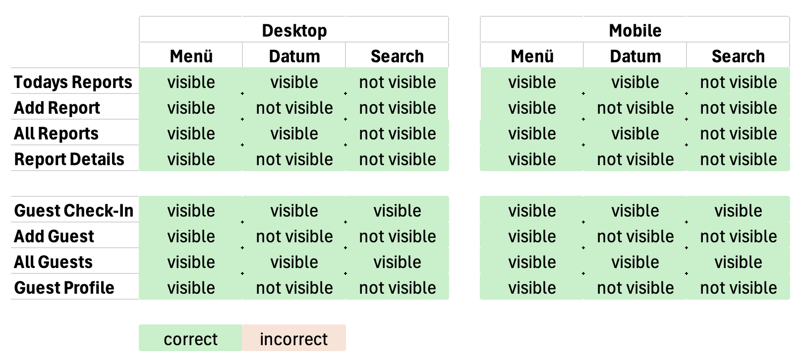

# Cityfur - Dog Day Care Guest Management System

## Introduction

Code Institute - Prortfilio Project 3 - Django Full-Stack Application

This application is developed for the real world use in a dog day care center in Cologne, Germany.

On a weekday bases, the day care center hosts up to 60 dogs simultaneously and makes sure that all needs of the guests are met.
The application helps with the daily tracking of dogs coming in the morning and leaving in the afternoon. It also helps with keeping all relevant information on display. Like times for applying medication or feeding schedules, and pickup by different individuals that are not the owner. It also includes a system for daily reports where dogs can be tagged to reports, if the report is about them. 

With the help of this system, the employees at the facility are always aware of:
- Guests present that day
- Guests checked-out and how many are still present
- Times for applying individual medication
- Times for individual feeding schedule
- Information about pickup from different individuals
- Look of a dog with profile picture
- Important information about every dog in an individual profile
- Situations that happened and were noted as a report with related dogs tagged

## Table of Contents

* [Introduction](#introduction)

* [User Experience](#user-experience)
  * [Login Credentials](#login-credentials)
  * [System Explained](#system-explained)
  * [User Stories](#user-stories)

## User Experience

### Login Credentials

### System explained

### Milestones

This project was structured in seven milestones with one or multiple user stories or tasks.

- [Basic project setup](https://github.com/DennisSchenkel/PP4-Cityfur/milestone/1)

- [Guest list and profiles](https://github.com/DennisSchenkel/PP4-Cityfur/milestone/3)

- [Guests profiles management (Add/Change/Delete)](https://github.com/DennisSchenkel/PP4-Cityfur/milestone/8)

- [Report system](https://github.com/DennisSchenkel/PP4-Cityfur/milestone/6)

- [User management & authentication](https://github.com/DennisSchenkel/PP4-Cityfur/milestone/2)

- [Final touch](https://github.com/DennisSchenkel/PP4-Cityfur/milestone/9)

- [The extra mile](https://github.com/DennisSchenkel/PP4-Cityfur/milestone/10)

### Epics

### User Stories

## Design

### Color Scheme

### Imagery

Images used as content for test purposes were created with ChatGPT and DALL-E 3.

### Typography

For this project, no special typography was used. 
The font is the standard font of the used browser.
Only different font-size and boldness were used.

### Wireframes

### Database

- Guest

- Presence

- Customer
Customers are the owners of the dogs. When adding a new guest, a customer has to be selected.
Although customers are a required field for creating new guests, at this point they can't be edited by users.
The sole purpose is to demonstrate 1:1 and 1:Many relationships in the database.

- Report

- Report-Guest Many:Many

## Features

### Technical Features

#### Search

The search is a special topic in this application. It is created by marking all not matching results as hidden using Bootstrap. All matching results are shown.

To avoid unnecessary loading times and giving instant feedback, the search was created this way and not by doing a separated get request with every search.
This method is only useful with a limited amount of profiles in the database. In the case of this application and its real world use, this is doable, since only a maximum of around 100 guests will be in the database simultaneously.

### Future Features

### Accessibility

## Technologies Used

### Languages

### Frameworks

The following frameworks have been used.

- [Django](https://www.djangoproject.com/)
- [Bootstrap](https://getbootstrap.com/)
- [jQuery](https://jquery.com/)
- [FontAwesome](https://fontawesome.com/)

### Modules & Libraries

### Programs & Tools

During the development of this application, the following programs and tools have been used.

- [Visual Studio Code](https://code.visualstudio.com/)
- [Figma](https://www.figma.com/)
- [dbdiagram.io](https://dbdiagram.io/)
- [Heroku](https://www.heroku.com/home)
- [Git](https://git-scm.com/)
- [GitHub](https://github.com/)
- [CI Postgres Database]
- [CI Python Linter]
- [Affinity Design 2](https://affinity.serif.com/de/designer/)
- [DALL-E 3 - for creating dog images]()

## Deployment

### Version Control

This application was developed using Visuel Studio Code as the IDE and GitHub for hosting the repository.

Git was used for version control by using the following comments:

- git add filename - Select the files that should be uploaded and updated to the GitHub repository.
- git commit -m "commit message" - Commenting the commit to better understand the changes in this specific commit.
- git push - Upload the commit to GitHub.

### Heroku Deployment

**Step 0: Create requirements.txt**
- Create the requirements.txt (pip freeze > requirements.txt)
- Make sure it contains all needed modules and libraries.
- Modify settings.py
    - Add Heroku to ALLOWED_HOSTS
    - Set DEBUG to "False"
- Create Procfile in root directory with the following content: web: gunicorn PP4_Cityfur.wsgi --log-file -
- Use python manage.py collectstatic in the local IDE terminal to collect all static files

**Step 1: Use Account**
- Create a Heroku account
- Log into the Heroku account

**Step 2: Create New App**
- On the dashboard, click "New" in the upper right corner.
- Select "Create new app"
- Select a name for the application - the name should only contain lowercase letters, numbers, and dashes.
- Choose a region. (Europe as we are in Europe)

**Step 3: Define Deployment Methode**
- Select GitHub as deployment methode
- Connect GitHub account to Heroku
- Select account and search for repository
- Connect to found repository

**Step 4: Settings**
- Switch to the settings page (Menu in the top)
- Click on "Reveal Config Vars"
- The following Key/Value pairs have been added:
    - CLOUDINARY_URL
    - DB_ENGINE
    - DB_HOST
    - DB_OPTIONS 
    - DB_PASSWORD
    - DB_PORT
    - DB_SSLMODE
    - DB_USER
    - SECRET_KEY
- In the next section, click on "Add buildpack"
- If not already selected, add Python.

**Step 5: Deploy Application**
- Switch to the deploy page (Menu in the top)
- Look under manual deployment
- Select a branch to deploy (Main in my case)
- Click "Deploy Branche"

**Step 6: Use App**
- Heroku will then set up the virtual envirement with all packages, modules and libraries needed. (This can take some time)
- When Heroku is done with the deployment, click "View" and start to use the
- Use app

### Cloudinary

## Testing

### Validator Testing

### Lighthouse Testing

### Automated Testing

### Manual Testing

#### Navigation Testing

Test if the navigation and their items are showing up and are working correctly on each site.

### Bugs During Development

### Possible Improvements

## Credits

### Acknowledgments

User management
- In the usecase of this app only the system admin should be allowed to create new users. So there is no public registration form of any kind.

Technologies and services used
- Heroku
- Cloudinary

Plugins used
- bootstrap_datepicker_plus

Steps of development:
- Starting with a basic html and css layout
- Adding the core functionality of guest checkin and checkout.
- Add functionality for searching guests, displaying critical information
- Building guest profiles and CRUD functionality
- Adding authentication feature for access controlle
- Adding basic report system
- Adding guest mentions to report system and showing related reports in guest profile

Features:
- Guest profiles (CRUD)
- Image upload with default profile image
- Search (no query but filter)
- Date selector
- Gender filter
- Mobile sidebar
- Check-in/Check-out
- Undo Check-in/Check-out
- Confirmations with modals
- Dynamic dropout system on guest list
- Report system (CRUD)
- Report indicator on guest list
- Medication indicator on guest list
- Food indicator on guest list
- Alternativ pickup with indicator on guest list
- Messages for user feedback
- User authentication

Bugs to mention: 
- Upload of images and the way I fixed it with pillow.
- Buggy closing of modals. Modals did not close properly when clicking outside of the modal.
- In development it came to the situation that the search field was not showing in the mobil view due to wrong use of bootstrap.

- When adding the Guest Update feature, the updated data was not saves, because the form validation has noticed the existing database entry as duplicate of the same dataset and so the validation threw an error.
    - To solve this, the validation has to ignore the duplicate of their own dataset. So exclude the dataset with given ID in the validation process.

Agile project management: 
During the process of deveolment, the kanban board and backlog, userstories, tasks and milestones where constantly addapting to new findings and changing requirements. Feature request have been modified, added or the priority was changed.